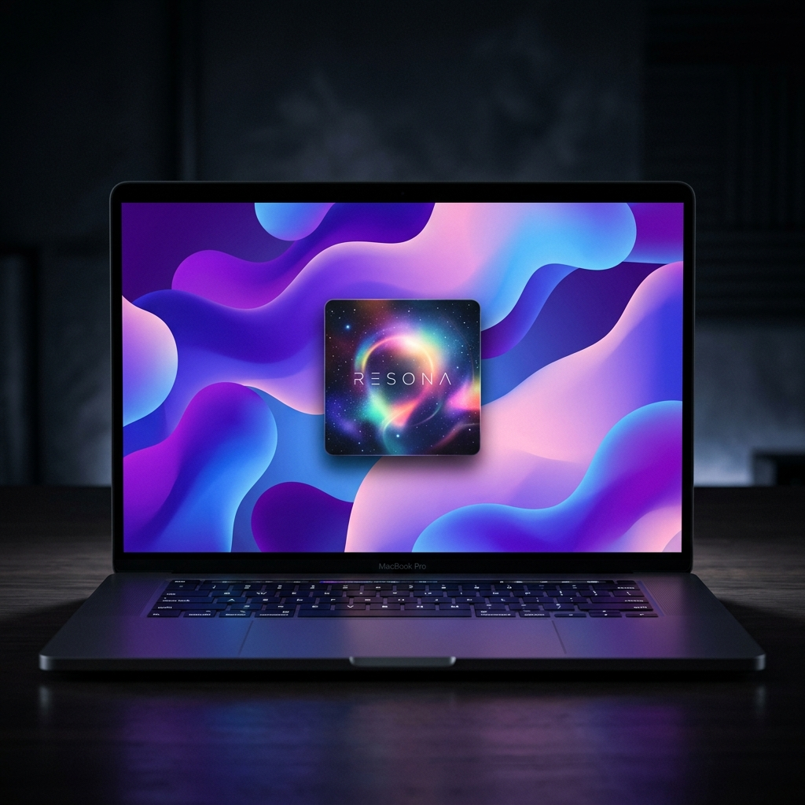

<p align="center">
  
</p>

<h1 align="center">Resona</h1>

<p align="center">
  <b>Your music, your wallpaper. Alive.</b><br>
  <sub>A macOS menu bar app that transforms your desktop into a living, breathing canvas of album art — powered by Metal shaders and real-time music detection.</sub>
</p>

<p align="center">
  
  
  
  
</p>

---

## What is Resona?

Resona detects what you're listening to — on **Spotify** or **Apple Music** — and transforms your entire desktop into an animated fluid wallpaper derived from the album artwork's color palette. When you stop playing music, it gracefully reverts back to your original wallpaper.

---

## Features

### Music Detection
- **Spotify** — OAuth-based integration via the Spotify Web API. Real-time polling detects track changes, playback state, and artwork.
- **Apple Music** — Zero-cost integration using `DistributedNotificationCenter` and AppleScript. No paid developer membership required.
- **Conflict Resolution** — If both services are playing simultaneously, Resona prompts you to pick one.

### Animated Wallpaper Engine
- **Metal Shader Rendering** — GPU-accelerated simplex noise fluid simulation with double domain warping, rendered directly to a desktop-level window at a thermally-optimized internal resolution.
- **Hybrid Color Extraction** — `CIAreaAverage` on a 3x3 spatial grid combined with farthest-first distinct color selection provides accurate, vibrant palettes for every album.
- **Spotify Canvas Support** — When available, plays Spotify's official looping Canvas videos as your wallpaper instead.
- **Multi-display** — Works across all connected screens simultaneously.
- **Smooth Transitions** — Programmatic fade between wallpapers.

### Customization
- **Wave Intensity Slider** — Control how much the fluid moves, from subtle shimmer to full-speed waves.
- **Static Mode** — Resona composites the album art over a blurred, vignetted background if you prefer a static image.
- **Stop Behavior** — Choose to keep the last album art or revert to your original wallpaper.
- **Cache Management** — Configurable cache size with optional auto-clear on quit.

### Menu Bar App
- Lives in your menu bar with no Dock icon and no main window.
- Shows current track, artist, album, and source at a glance.
- One-click connect/disconnect for each music service.

---

## How It Works

```
┌─────────────────────────────────────────────────────────┐
│                    Music Detection                      │
│  ┌──────────────┐            ┌───────────────────┐      │
│  │   Spotify     │            │   Apple Music      │    │
│  │  (OAuth API)  │            │  (AppleScript +    │    │
│  │  1s polling   │            │   Notifications)   │    │
│  └──────┬───────┘            └────────┬──────────┘      │
│         └──────────┬─────────────────┘                  │
│                    ▼                                    │
│          MusicDetectionService                          │
│          (conflict resolution)                          │
│                    │                                    │
│                    ▼                                    │
│           WallpaperManager                              │
│          ┌────────┴────────┐                            │
│          ▼                 ▼                            │
│    Animated Mode      Static Mode                       │
│   (Metal shader)    (CIFilter compose)                  │
│          │                 │                            │
│          ▼                 ▼                            │
│   AnimatedWallpaper   NSWorkspace                       │
│    Controller        .setDesktopImage                   │
└─────────────────────────────────────────────────────────┘
```

---

## Getting Started

### Requirements
- **macOS 14 Sonoma** or later
- **Xcode 15+** with Swift 5.9+
- A Spotify and/or Apple Music account

### Build & Run
```bash
git clone https://github.com/ParthG2209/Resona.git
cd Resona
open Resona.xcodeproj
```

### First Launch
1. Resona appears in your menu bar.
2. Click the menu bar icon and connect Spotify and/or Apple Music.
3. For Spotify: you will be redirected to authorize via browser. The OAuth callback (`resona://callback/spotify`) handles the rest.
4. For Apple Music: macOS will prompt you to allow Resona to control Music.app. Click Allow.
5. Play a song.

---

## Configuration

| Setting | Default | Description |
|---------|---------|-------------|
| Wave Intensity | 50% | Controls fluid animation speed (0 = still, 100% = full motion) |
| Animated Wallpapers | On | Toggle between animated (Metal) and static (composed image) mode |
| Transition Style | Fade | Fade (2s) or Instant wallpaper transitions |
| On Music Stop | Keep Last Art | Keep the last wallpaper or revert to your original |
| Cache Size | 500 MB | Maximum artwork cache size on disk |
| Clear Cache on Quit | Off | Auto-delete cached artwork when Resona closes |

All settings are accessible from the Settings section in the menu bar drop-down.

---

## Architecture

```
Resona/
├── App/
│   └── ResonaApp.swift           # Entry point, AppDelegate, menu bar setup
├── Models/
│   ├── Track.swift               # Unified track model
│   ├── AppSettings.swift         # UserDefaults-backed preferences
│   ├── Artwork.swift             # Artwork metadata
│   └── SpotifyModels.swift       # Spotify API response models
├── Services/
│   ├── MusicDetectionService.swift    # Central coordinator
│   ├── SpotifyService.swift           # Spotify OAuth + Web API polling
│   ├── SpotifyCanvasService.swift     # Canvas video fetching
│   ├── AppleMusicService.swift        # AppleScript + notification detection
│   ├── WallpaperManager.swift         # Routes to animated vs static mode
│   └── AnimatedWallpaperController.swift  # Metal shader engine + color extraction
├── UI/
│   ├── MenuBarView.swift         # Menu bar dropdown UI
│   ├── SettingsView.swift        # Settings window (tabs)
│   ├── ServiceConflictView.swift # "Both playing" conflict dialog
│   └── DefaultWallpaperPickerView.swift  # First-launch wallpaper selection
├── Cache/
│   └── ArtworkCache.swift        # Disk-based artwork caching
└── Utilities/
    ├── Constants.swift           # API keys, endpoints, configuration
    ├── KeychainManager.swift     # Secure credential storage
    ├── Logger.swift              # Categorized logging
    └── URLSchemeHandler.swift    # OAuth callback URL handler
```

### Key Technical Details

| Component | Technology |
|-----------|-----------|
| Fluid Animation | Metal fragment shader with simplex noise + domain warping |
| Color Extraction | `CIAreaAverage` on 3x3 grid -> farthest-first distinct selection |
| Spotify Auth | OAuth 2.0 PKCE flow with Keychain-stored tokens |
| Spotify Canvas | Unofficial protobuf API via `sp_dc` cookie + TOTP |
| Apple Music Detection | `DistributedNotificationCenter` + AppleScript polling |
| Apple Music Artwork | `NSAppleScript` -> `raw data of artwork 1` from Music.app |
| Window Management | `NSWindow` at `.desktop` level |
| Video Playback | `AVQueuePlayer` + `AVPlayerLooper` for seamless Canvas loops |
| Settings Storage | `UserDefaults` via `@UserDefault` property wrapper |
| Credentials | macOS Keychain via Security framework |

---

## The Shader

Resona's fluid wallpaper is powered by a real-time Metal fragment shader that outputs:
1. Simplex Noise to generate organic, flowing patterns
2. Double Domain Warping for fluid-like distortion
3. 5-Color Palette Blending to smoothly interpolate between the extracted colors
4. Radial Vignette to add depth with subtle darkening at the edges
5. Hardware upscaling running at half internal resolution for a massive thermal reduction

---

## Spotify Canvas

Spotify Canvas displays a short looping video attached to tracks. When available, Resona plays the Canvas video as your wallpaper instead of the fluid animation.

This uses Spotify's internal API, requiring your `sp_dc` cookie and a TOTP-based authentication flow.

---

## Apple Music

Resona uses a completely free integration method for Apple Music without requiring an Apple Developer Program membership.

| Step | Method |
|------|--------|
| Detect track changes | `DistributedNotificationCenter` -> `com.apple.Music.playerInfo` |
| Get track metadata | Notification `userInfo` (name, artist, album, state) |
| Poll as fallback | AppleScript queries Music.app every 2 seconds |
| Get album artwork | `NSAppleScript` -> `raw data of artwork 1 of current track` |

The only requirement is granting Automation permission when prompted in macOS.

---

## Known Limitations

- Spotify Canvas relies on unofficial APIs and may change with Spotify server updates.
- Apple Music artwork extraction requires the native Music.app to be running.
- macOS Sandbox: Due to AppleScript constraints, this app is designed for direct distribution rather than the Mac App Store.

---

## License

This project is licensed under the MIT License. See LICENSE for details.

---

<p align="center">
  <sub>Built with Metal shaders by <a href="https://github.com/ParthG2209">Parth Gupta</a></sub>
</p>
